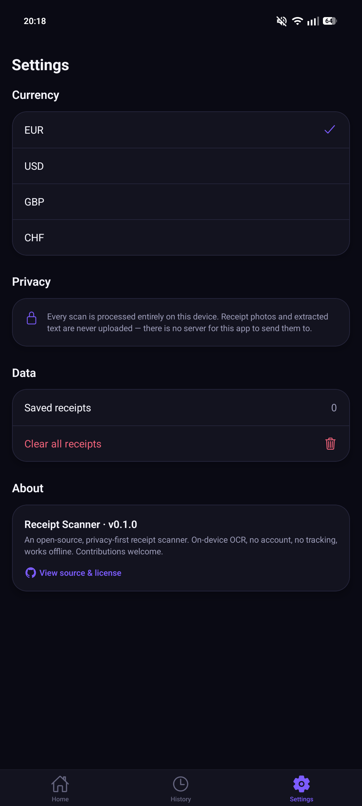
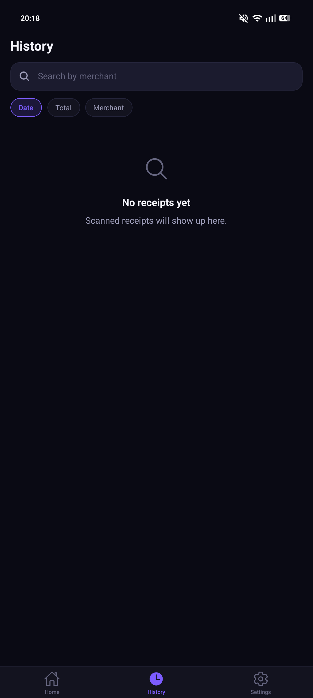
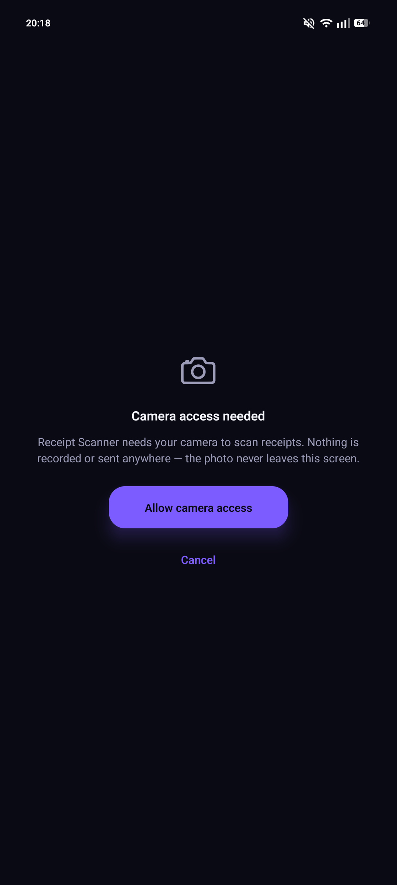

# 🧾 Receipt Scanner

[](https://reactnative.dev/)
[](https://expo.dev/)
[](https://www.typescriptlang.org/)
[]()
[](LICENSE)

An open-source, privacy-first mobile app that scans paper receipts, reads them with on-device OCR, and turns them into structured, searchable records — merchant, date, line items, tax, total.

Built around one hard constraint: everything — camera, OCR, parsing, storage — happens on the device. Most receipt-scanning apps default to a cloud OCR call and an account; this one doesn't have that option available even if it wanted to. No account, no backend, no analytics, fully usable offline.

## Table of Contents

- [Preview](#preview)
- [Features](#features)
- [Known Issues & Unverified Areas](#known-issues--unverified-areas)
- [Tech Stack](#tech-stack)
- [Architecture](#architecture)
- [Design Decisions](#design-decisions)
- [Project Structure](#project-structure)
- [Getting Started](#getting-started)
- [Usage](#usage)
- [Configuration and Environment](#configuration-and-environment)
- [Roadmap](#roadmap)
- [Changelog](#changelog)
- [Contributing](#contributing)
- [License](#license)

## Preview

*Drop screenshots into `images/` at the repo root using the names below — a few screens are still missing and will slot in the same way once captured.*

|  |  |
|:--:|:--:|
| **Settings** | **History** *(empty state)* |

|  | |
|:--:|:--:|
| **Camera Permission** | *(Home, Scanner, Review, Details — coming soon: `home.png`, `scanner.png`, `review.png`, `details.png`)* |

## Features

### Home

- Monthly spend summary card
- Primary "Scan Receipt" call to action
- Recent receipts (last 5), tapping through to full details
- Empty state on first launch, "See all" link through to History once there's at least one receipt

### Scanner

- Full-screen camera preview with an animated violet corner-bracket frame
- Live status text through capture → OCR → processing states
- Manual capture rather than continuous edge detection (see Design Decisions)
- A clear, on-brand camera-permission screen, including what happens if access is denied
- "Processed on device" privacy indicator always visible on screen

### Scan Review

- Every extracted field shown with a confidence badge — *Detected* or *Needs review*
- Full inline editing: merchant, date, currency, items, subtotal, tax, total
- Flags when the line items don't add up to the entered total
- Items can be edited or removed individually before saving

### Receipt Details

- Full read view of a saved receipt
- Inline edit mode for merchant, date, and item names/prices
- Delete with a confirmation prompt

### History

- Search by merchant
- Sort by date, total, or merchant
- Pull-to-refresh
- Distinct empty states for "no receipts yet" vs. "no search matches"

### Settings

- Currency picker (EUR / USD / GBP / CHF)
- Plain-language privacy explanation
- Saved-receipt count and a "Clear all receipts" action, with confirmation
- About section with version number and a link to source & license

### General

- Fully on-device — no account, no backend, no analytics, works offline
- Single dark theme by design, not an unfinished light mode (see Design Decisions)
- English UI; the parser itself recognizes both English and Italian receipt vocabulary, since the language printed on a receipt and the app's interface language are different concerns

## Known Issues & Unverified Areas

- **Confirmed on a real Android device:** the Settings screen, the History empty state, and the camera-permission screen all render correctly, matching the built design exactly.
- **Not yet confirmed:** a full capture → OCR → parse → save round trip on a real receipt. Each piece is checked independently — the parser against realistic sample OCR text, the storage layer's SQL against a real SQLite engine, a full Metro bundle exported clean for both iOS and Android — but that's not the same as scanning an actual receipt end to end.
- No live/continuous receipt edge detection — capture is manual (position, then tap). See Design Decisions.
- Parsing is heuristic/keyword-based; unusual layouts (handwritten, extremely faded, non-tabular item formats) will likely need the parser extended.
- The scanner frame's size is computed once at mount, not reactive to window-size changes (e.g. Android split-screen).

## Tech Stack

| Dependency | Version | Notes |
|---|---|---|
| Expo SDK | 57 | |
| React Native | 0.86.3 | New Architecture enabled (`newArchEnabled: true`) |
| React | 19.2 | |
| TypeScript | 6.0, strict mode | |
| `expo-camera` | 57.0.4 | Capture only — see Design Decisions for why not `react-native-vision-camera` |
| `@react-native-ml-kit/text-recognition` | 2.0.0 | On-device OCR (Google ML Kit). Native module — requires a dev build, not compatible with Expo Go |
| `expo-sqlite` | 57.0.2 | Sole persistence layer |
| React Navigation | 7.x | native-stack + bottom-tabs |
| React's built-in `Animated` API | — | Used instead of `react-native-reanimated` — see Design Decisions |

## Architecture

### Screens

| Screen | Notes |
|---|---|
| `HomeScreen` | Dashboard — monthly spend, scan CTA, recent receipts |
| `ScannerScreen` | Camera capture → on-device OCR → parse — the app's hero flow |
| `ScanResultScreen` | Review/edit screen shown right after a scan, before saving |
| `ReceiptDetailsScreen` | View, edit, and delete a saved receipt |
| `ReceiptHistoryScreen` | Search and sort all saved receipts |
| `SettingsScreen` | Currency, privacy info, data management, about |

### Key Modules

| Module | Purpose |
|---|---|
| `services/ocr/textRecognition.ts` | Thin wrapper around ML Kit — isolates the vendor package behind local `OcrResult`/`OcrBlock` types |
| `services/parser/receiptParser.ts` | Pure text → `ParsedReceipt` logic. No React Native dependency — runnable in plain Node |
| `services/storage/receiptRepository.ts` | SQLite CRUD, search, sort |
| `services/settings/settingsStore.ts` | Currency and app preferences, persisted in the same database |
| `theme/tokens.ts` | The entire design system — color, type, spacing, radii, shadow, motion |

### Key Patterns

- Every parsed field carries a confidence (`detected` / `uncertain` / `manual`) instead of being a bare value — the review screen reads this directly to decide what to flag for the user
- The parser scopes item-line scanning to between the header block and the summary block (subtotal/tax/discount/total keywords), which is what keeps a store address or a VAT/phone number from ever being mistaken for a product line
- `scripts/verify-parser.ts` and `scripts/verify-sql.cjs` check the two riskiest layers — OCR-text parsing and SQL — against real inputs without needing a device

## Design Decisions

**Why on-device ML Kit instead of a cloud OCR API?** Privacy is the whole premise of this app, not a feature bullet point — a cloud OCR call was never on the table regardless of any accuracy tradeoff, since it would mean a receipt's contents leaving the device.

**Why manual capture instead of live continuous scanning?** Real-time document edge detection needs frame-by-frame computer vision (`react-native-vision-camera` + frame processors), which adds a large native surface that's hard to get right without a device to test against. Position-and-tap is simpler, more reliable, and is how most receipt-scanner apps actually work day to day.

**Why React Native's built-in `Animated` API instead of `react-native-reanimated`?** Reanimated needs its own native build step and worklet configuration. `Animated` ships with core React Native, needs no extra native setup, and was the safer choice to build without a device attached to verify the config against.

**Why does the parser handle Italian receipt vocabulary when the app's UI is English-only?** The UI language and the language printed on a physical receipt are different concerns. The parser recognizes both without it affecting the interface.

**Why SQLite instead of a simpler key-value store?** Receipts need real queries — search by merchant, sort by date or total, sum a month's spending — that a flat key-value store makes awkward. `expo-sqlite` gives that for free.

**Why does the parser return `null` instead of guessing a value it isn't confident about?** An invented total or date is worse than an empty field — a wrong-but-confident-looking number is the kind of error a user won't think to double check. The review screen is where a human confirms it, not the parser.

**Why no light theme?** The dark navy / violet look isn't a color scheme bolted onto the app — it's the whole visual identity, down to the scanner glow. A half-built light mode would dilute that rather than extend it.

## Project Structure

```
receipt-scanner/
├── App.tsx                        # Entry point — gesture handler, safe area, root navigator
├── app.json                       # Expo config — dark UI, camera permissions, plugins
├── eas.json                       # EAS Build profiles (development / preview / production)
├── package.json
├── scripts/
│   ├── verify-parser.ts           # Runs the parser against sample English/Italian receipts
│   ├── verify-sql.cjs             # Runs the storage layer's SQL against a real SQLite engine
│   └── generate-icon.py           # Regenerates the app icon/splash from the theme tokens
├── src/
│   ├── theme/tokens.ts            # Design system — color, type, spacing, radii, shadow, motion
│   ├── types/receipt.ts           # Receipt / ReceiptItem / ParsedReceipt domain model
│   ├── navigation/                # Typed root stack + bottom tabs
│   ├── screens/                   # One file per screen — see Architecture above
│   ├── components/
│   │   ├── ui/                    # Button, Card, Amount, Badge, EditableField, …
│   │   ├── receipt/                # ReceiptCard, ReceiptItemRow
│   │   └── scanner/                # ScannerFrame (animated), ScannerStatus
│   ├── services/
│   │   ├── ocr/                   # ML Kit wrapper
│   │   ├── parser/                # Pure text → ParsedReceipt logic
│   │   ├── storage/                # SQLite schema + repository
│   │   └── settings/               # Currency + preferences
│   ├── hooks/                     # useReceipts, useReceipt
│   └── utils/                     # Currency/date formatting, id generation, error mapping
├── images/                        # Screenshots used in this README
├── LICENSE
└── README.md
```

## Getting Started

### Prerequisites

- Node.js 20+
- A physical iOS or Android device is strongly recommended — most simulators/emulators don't have a usable real camera, and this app's core feature is the camera
- No Expo account required for local development; an account is only needed for EAS Build

### Installation

```bash
git clone https://github.com/mirconegri/receipt-scanner.git
cd receipt-scanner
npm install
```

## Usage

### Development

This app uses a native module (on-device OCR), so it **cannot run in Expo Go** — it needs a development build:

```bash
npx expo prebuild
npx expo run:android   # or: npx expo run:ios (requires a Mac + Xcode)
```

After the first build, day-to-day development can go back to `npx expo start` and reopening the app on the device you already built to.

### Everyday checks

```bash
npm run typecheck      # tsc --noEmit
npm run lint            # eslint .
npm run verify-parser   # parser against sample receipts, no device needed
npm run verify-sql      # storage layer's SQL against a real SQLite engine, no device needed
```

### Building for testing (no local Xcode/Android Studio needed)

```bash
npx eas-cli@latest login
npx eas-cli@latest build --profile preview --platform android
# or --platform ios — still no Mac required, the build runs on Expo's servers
```

## Configuration and Environment

No `.env` file and no API keys required — there's no backend to configure. Configuration lives in:

| File | Purpose |
|---|---|
| `app.json` | Expo metadata — app name, bundle identifier/package, dark UI style, camera permission strings, plugins |
| `eas.json` | EAS Build profiles — `development`, `preview`, `production` |
| `src/constants.ts` | Repo URL and app version shown in Settings → About |

All receipt data is persisted via `expo-sqlite`, entirely on-device.

## Roadmap

1. **Run and fix against a real end-to-end scan** — the one thing that couldn't be verified while building this: point it at an actual receipt and see what the parser gets wrong
2. **Live receipt edge detection** — replace manual capture with real-time framing feedback
3. **Export receipts** — CSV/PDF
4. **Category tagging** and spend-by-category breakdowns
5. **Additional receipt-format locales** beyond the current English/Italian keyword sets
6. **Optional cloud backup** of the local database (opt-in, and still no receipt content ever going through a server this project runs)

## Changelog

| Version | Date | Highlights |
|---|---|---|
| `v1.0.0` | Sep 2026 | Initial release — camera capture, on-device OCR (English/Italian receipts), local SQLite storage, full review/edit flow, history search/sort, settings |

## Contributing

1. Fork the repository
2. Create a feature branch (`git checkout -b feature/your-feature`)
3. Commit your changes with a clear message
4. Open a Pull Request

A parser change should keep `npm run verify-parser` passing, and ideally add a new sample receipt that exercises whatever you changed. Don't invent a value the OCR/parser didn't confidently detect — return `null` and let the review screen ask the user. For bugs or feature ideas, open an [Issue](https://github.com/mirconegri/receipt-scanner/issues).

### Author

**Mirco Negri** — Computer Science @ UniTrento

[](https://mirconegri.github.io/Portfolio/)
[](https://github.com/mirconegri)
[](https://www.linkedin.com/in/mirco-negri-263810225)
[](mailto:mirconegri06@gmail.com)

## License

This project is licensed under the MIT License — see the [LICENSE](LICENSE) file for details.
